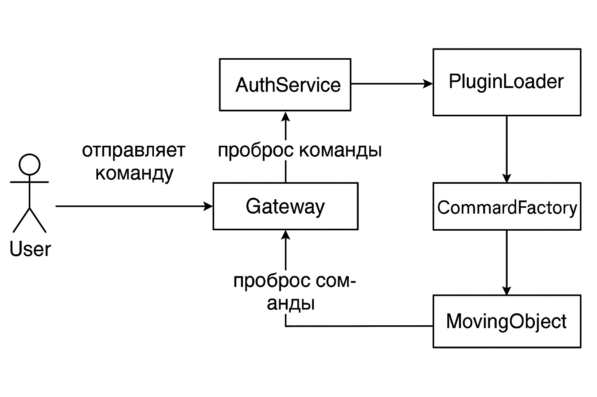
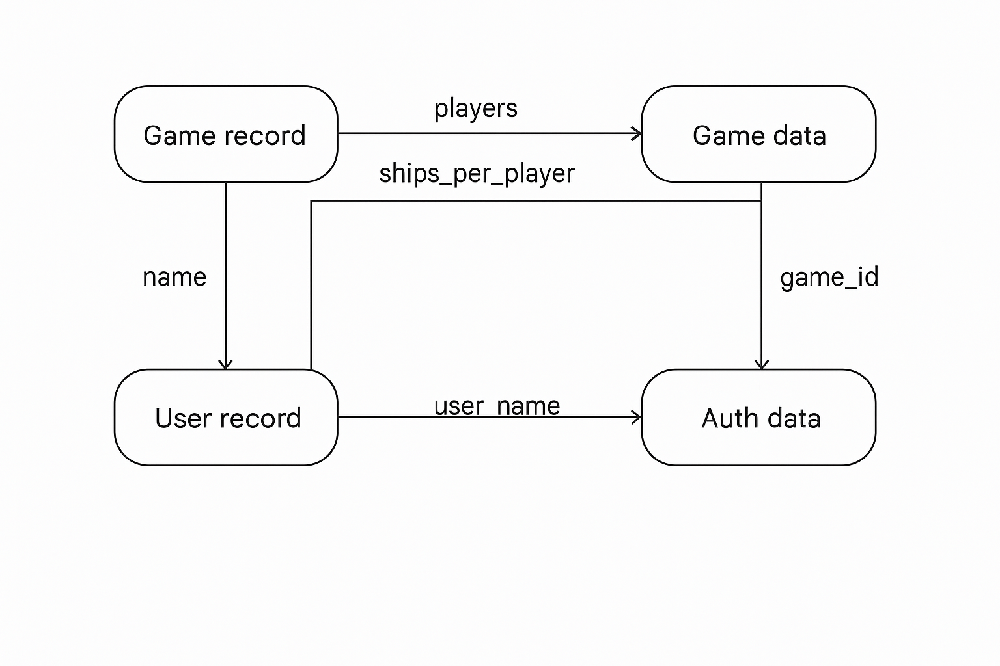
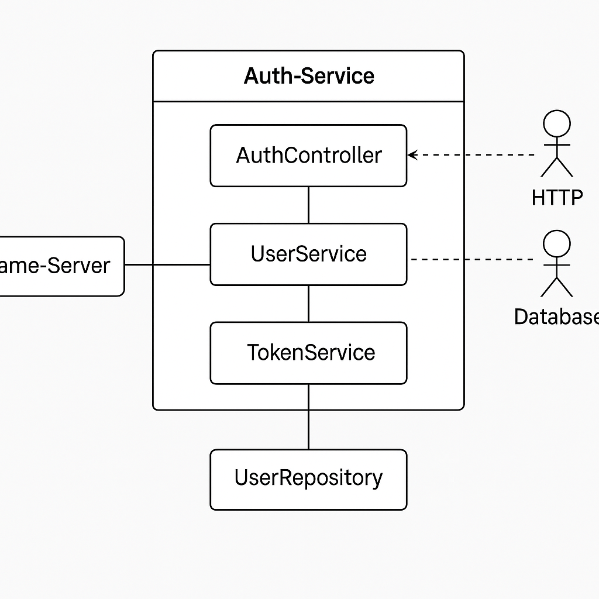

# SpaceBattle Plugin System

**SpaceBattle** — модульная система с поддержкой плагинов, динамической загрузки команд, middleware и интеграций, ориентированная на расширяемость и поддержку микросервисной архитектуры. Реализована на Java 19, с использованием Spring Boot, Kafka, Docker и собственного IoC-контейнера.

## Возможности

* Расширение через плагины (.jar): команды, middleware, bootstrap-классы, exception handlers
* Универсальный формат плагина: YAML-описание `plugin.yaml`
* DSL для описания объектов игры (поддерживает координаты, углы, скорости)
* IoC-контейнер собственной разработки + поддержка регистрации из DSL
* Поддержка Kafka, HTTP, Gateway через транспортные плагины
* Простая реализация авторизации через токены (JWT)
* Интеграция с игровой и авторизационной логикой
* Сборка и запуск через Docker Compose
* CI/CD: GitHub Actions + отчёт покрытия кода

---

## Архитектура

### Компоненты:

* auth-service — Spring Boot микросервис регистрации/входа, выдаёт JWT, управляет играми
* game-server — основной сервер игры, обрабатывает команды, запускает EventLoop
* plugins — каталог jar-плагинов, автоматически загружаемых и отслеживаемых
* client — JavaFX клиент для управления кораблём
* gateway — Spring Cloud Gateway для JWT-фильтрации и маршрутизации
* core — модуль с базовыми интерфейсами и утилитами (IoC, DSL, exceptions и т.д.)



---

## Бизнес-процессы

1. Регистрация/логин через auth-service
2. Создание игры и выдача `gameId` с параметрами (игроки, корабли)
3. Регистрация объектов на game-server, получение `objectId`
4. Получение токена и objectId по `gameId`
5. Отправка команды (move, rotate и др.) на сервер через Kafka/HTTP
6. Выполнение команды через зарегистрированную фабрику и IoC
7. Обратная связь (новое состояние отправляется на клиент)



---

## Безопасность и авторизация

* JWT токен выдаётся после логина или регистрации
* Токен содержит `username`, `gameId`, срок действия
* Проверка на нескольких уровнях:

  * Gateway (`JwtAuthFilter`) — базовая проверка формата
  * GameServer (`AuthMiddleware`) — проверка objectId, gameId
* Поддержка фильтрации через Spring Security и `SecurityConfig`
* Возможные улучшения:

  * Проверка подписи токена (RSA)
  * Ограничения по ролям (например, creator/admin)
  * Аудит действий и журналирование отказов

---

## Сложности и будущие риски

### Расширение функциональности:

* Возможность конфликтов между плагинами (решается изоляцией ClassLoader)
* Расширение DSL требует согласованной схемы нормализации и валидации
* Риск ошибок при загрузке: добавлена централизованная обработка исключений и fallback-обработчики

### Безопасность:

* Текущая проверка токена не гарантирует целостность — желательно реализовать подпись
* Отсутствует ограничение по действиям для разных типов пользователей
* Возможен доступ к незарегистрированным объектам — рекомендуется доработать фильтрацию в middleware

---


## Архитектурные сложности и принятые решения

### Проблема: Поддержка динамического расширения без перезапуска
**Сложность**: невозможно предсказать, какие команды или логика будут добавлены в будущем.  
**Решение**: реализована система плагинов с загрузкой `.jar` в рантайме, использование `ClassLoader` с изоляцией, формат `plugin.yaml` для описания содержимого.

### Проблема: Централизация и гибкость инфраструктуры обработки команд
**Сложность**: необходимость гибко переключать транспорт (Kafka, HTTP) без переписывания логики.  
**Решение**: команды поступают через обобщённый `dispatchCommand`, зарегистрированный в IoC. Это позволяет добавлять/удалять transport-плагины независимо.

### Проблема: Рост сложности DSL и бизнес-логики
**Сложность**: при добавлении новых параметров, объектов или логики легко нарушить совместимость.  
**Решение**: используется централизованный парсер DSL, компоненты определяются декларативно, ошибки обрабатываются через exception middleware.

### Проблема: Проверка авторизации и привязка к `objectId`/`gameId`
**Сложность**: нужно обеспечить безопасность без дублирования логики.  
**Решение**: реализована прослойка `AuthMiddleware`, которая проверяет токен и права пользователя на объект в рамках конкретной игры.

### Проблема: Сложности интеграционного тестирования системы
**Сложность**: множество компонентов (Kafka, Docker, микросервисы) затрудняют ручное тестирование.  
**Решение**: реализован CI-процесс с автосборкой, поднятием сервисов и агрегированным отчётом покрытия.

### Проблема: Автоматическая оценка покрытия
**Сложность**: часть модулей — не Maven-модули, не входят в `parent`, но должны участвовать в агрегированном отчёте.  
**Решение**: отдельный проект `coverage-report` агрегирует покрытия из всех модулей, независимо от того, входят ли они в родительский `pom`.


## Критерии приёмки

* Покрытие тестами ≥ 90% (Jacoco)
* Расширяемость без изменений кода:

  * Реализованы: команды, middleware, exceptionHandlers, DSL
* IoC:

  * Используется разрешение зависимостей и DI
* Микросервисы:

  * Разделены по приложениям
  * Docker Compose
* Паттерны проектирования:

  * Factory, Adapter, Observer, IoC, Plugin
* Указаны проблемы архитектуры и пути их решения

---

## Запуск через Docker Compose

```bash
git clone https://github.com/YOUR_USERNAME/spacebattle-plugin-system.git
cd spacebattle-plugin-system
docker-compose up --build
```

Доступные сервисы:

* auth-service: [http://localhost:8081](http://localhost:8081)
* game-server: [http://localhost:8080](http://localhost:8080)
* gateway: [http://localhost:8082](http://localhost:8082)

---

## CI/CD

Проект использует GitHub Actions для автоматической сборки, запуска тестов и генерации отчёта покрытия:

```yaml
name: Java CI + Code Coverage

on:
  push:
    branches:
      - master
  pull_request:
    branches:
      - master

jobs:
  build:
    runs-on: ubuntu-latest
    services:
      postgres:
        image: postgres:15
        ports:
          - 5432:5432
        env:
          POSTGRES_USER: space
          POSTGRES_PASSWORD: battle
          POSTGRES_DB: spacebattle
        options: >-
          --health-cmd pg_isready
          --health-interval 10s
          --health-timeout 5s
          --health-retries 5

    steps:
      - uses: actions/checkout@v3
      - uses: actions/setup-java@v3
        with:
          java-version: '19'
          distribution: 'temurin'

      - uses: actions/cache@v3
        with:
          path: ~/.m2/repository
          key: ${{ runner.os }}-maven-${{ hashFiles('**/pom.xml') }}
          restore-keys: ${{ runner.os }}-maven

      - run: mvn clean verify -Dspring.datasource.url=jdbc:postgresql://localhost:5432/spacebattle

      - uses: actions/upload-artifact@v3
        if: always()
        with:
          name: jacoco-report
          path: target/site/jacoco-aggregate
```

Для локальной генерации покрытия:

```bash
mvn clean verify
firefox target/site/jacoco-aggregate/index.html
```

---

## Плагины и структура plugin.yaml

Пример `plugin.yaml`:

```yaml
plugin:
  name: movement-plugin
  commands:
    - name: move
      handler: org.spacebattle.MoveCommandFactory
  bootstrap:
    - class: org.spacebattle.MovePluginBootstrap
  exceptionHandlers:
    - class: org.spacebattle.ClientInputExceptionHandler
```

Плагин может включать:

* commands: регистрация команд и их фабрик
* middleware: обёртки над командами
* bootstrap: классы, вызываемые при загрузке
* exceptionHandlers: перехватчики исключений

---

## Информационные схемы

* События и команды хранятся в формате JSON
* Каждое сообщение содержит `command`, `objectId`, `params`
* Внутри game-server объекты реализуют интерфейс `IUObject` и получают команды через `CommandDTO`



---

## Используемые шаблоны проектирования

* Factory Method — для создания команд через `CommandFactory`
* Adapter — привязка IUObject к интерфейсу `MovingObject`
* IoC/DI — собственный IoC-контейнер + внедрение зависимостей
* Observer — EventLoop подписывается на команды
* Plugin — загрузка внешних jar и их обработка

---

## Документация и схемы

* docs/component-diagram.png — компонентная диаграмма
* docs/integration-diagram.png — схема интеграции
* docs/data-flow-diagram.png — схема потока команд
* examples/objects.yaml, examples/commands.json — примеры DSL

---

## Авторы и лицензия

* Автор: Юрий Петухов
* Лицензия: MIT

---

## TODO / Возможные улучшения

* Реализация GraphQL API для запроса состояния игры
* Визуальный редактор DSL
* WebSocket клиент
* Улучшение логирования и трейсинга событий
* Проверка подписи JWT (RSA)
* Ограничения доступа на уровне ролей
* Поддержка плагинов с подпиской на события (event listeners)
